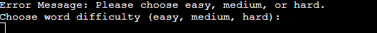
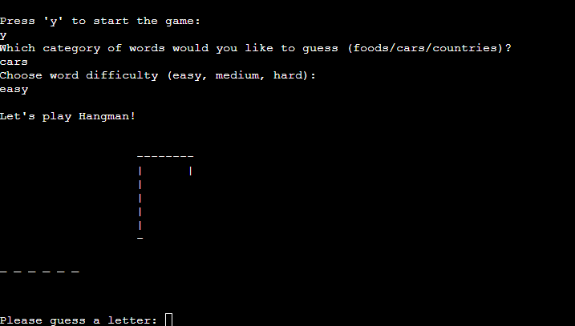

# Hangman-game
This Python-based Hangman game enables users to guess words, categorized into different topics and difficulty levels, by iteratively selecting letters, while visually tracking incorrect guesses through ASCII hangman illustrations.

You can find the live link here: [Hangman-game](https://hangman-alex025x-fe0e2eb59e31.herokuapp.com/)

---

# Table of Contents

---

- [Hangman-game](#hangman-game)
- [Overview](#overview)
  - [Project](#project)
- [Game Structure](#game-structure)
  - [Start Screen](#start-screen)
  - [Category and Difficulty Selection](#category-and-difficulty-selection)
  - [Input Validation](#input-validation)
  - [Main Game](#main-game)
  - [End of Round](#end-of-round)
- [Potential future updates](#potential-future-updates)
- [Hangman Game primary components](#hangman-game-primary-components)
  - [1. Word Management](#1-word-management)
  - [2. Display Management](#2-display-management)
  - [3. Game Flow & Logic](#3-game-flow--logic)
- [Testing](#testing)
  - [Validator Testing](#validator-testing)
  - [Hangman Game - Manual Testing](#hangman-game---manual-testing)
- [Technologies](#technologies)
- [Bugs](#bugs)
- [Credits](#credits)

# Overview
  ## Project
   The game starts with the games logo and a welcome introduction and explanation of the game.

   The Hangman game provides a word-guessing experience where a player selects a category and difficulty level, then has to identify a hidden word by suggesting letters. A partial hangman figure gets drawn with each incorrect guess, and the player is allowed up to 6 mistakes. Displayed underscores signify the word length, and a list assists in tracking previously guessed letters.
   
   The Player wins if he guesses the word before the hangman is fully drawn; otherwise, the correct word is revealed upon loss. The Player then can choose to play again or exit the game.

# Game Structure

## Start Screen
- **Logo and Welcome:** A symbol-created logo is displayed along with a welcoming message.
- **Instructions:** Provides easy-to-understand instructions for how to play.
- **Game Initiation:** Player begins the game by pressing 'y'.

## Category and Difficulty Selection
- **Category Choice:** Player selects a word category (foods, cars, countries).
- **Difficulty Choice:** Player selects a difficulty level (easy, medium, hard).

## Input Validation
- **Correct Input:** Ensures the player’s input adheres to acceptable parameters (e.g., 'y' to start, valid category, and difficulty).
- **Error Messaging:** Informative error messages guide the player towards valid inputs.

## Main Game 
- **Word Representation:** Displays underscores (_) representing the secret word's letters.
- **Letter Guessing:** Player attempts to reveal the word by guessing letters one at a time.
- **Hangman Figure:** Incorrect guesses visually build a hangman drawing and guessess become less.
- **Guessed Letters:** Displays a list to track and show letters the player has already guessed.

## End of Round
- **Outcome:** Reveals whether the player won or lost and shows the correct word.
- **Replay Option:** Presents the player with the choice to play again or exit.

## Potential future updates
 Future updates for the Hangman game include better player experience through expanded and customizable word categories, the addition of user profiles and competitive leaderboards, along with a notable uplift in graphical and user interaction, moving from ASCII to a more vibrant and intuitive UI/UX.

# Hangman Game primary components

This Hangman game allows the user to guess words from chosen categories and difficulty levels. Below are the primary components and functions utilized in the game:

## 1. Word Management
Handles the selection and representation of words for the game.

### Functions:
#### **choose_word(category, difficulty)**:
  - **Description**: Chooses a word based on the given category and difficulty.
  - **Parameters**:
    - `category`: The theme of the word (e.g., foods, cars, countries).
    - `difficulty`: The level of difficulty (e.g., easy, medium, hard).
  - **Returns**: A randomly selected word from the specified category and difficulty.

### Data:
#### **words dictionary**:
  - **Description**: Contains lists of words categorized by theme and difficulty level.

## 2. Display Management
Manages the visual representation of the game.

### Functions:
#### **display_hangman(tries)**:
  - **Description**: Displays the hangman figure based on the number of incorrect tries.
  - **Parameters**: 
    - `tries`: Number of incorrect guesses made by the player.
  - **Returns**: A visual representation of the hangman figure for the current game state.

#### **print_logo_and_explanation()**:
  - **Description**: Outputs the game's logo and provides an explanation of how to play.
  - **Returns**: Printed logo and game instructions.

## 3. Game Flow & Logic
Controls the game's main loop, logic, and interactions with the user.

### Functions:
#### **play_hangman()**:
  - **Description**: The main game loop where players guess letters and the game determines the outcome based on the guesses.
  - **Returns**: Boolean value indicating if the user wants to play another round.

#### **play_again()**:
  - **Description**: Prompts the user to decide if they want to play another round.
  - **Returns**: Boolean value (True if the user wants to play again, False otherwise).

### Game Initialization:
The game prompts the user to start, choose a category, and select a difficulty level. It then engages the player in rounds of guessing letters, displaying progress, and determining the game outcome.

# Testing

## Validator Testing

# Hangman Game - Manual Testing

## **Test Scenario 1: Start the Game**

### Test Steps:
1. Execute the program.
2. Prompted to press 'y' to start the game.

### Test Input:
- `y`

### Results:
- Hangman logo and game explanation displayed.
- Prompt to press 'y' to start the game appeared.
- Successful transition to category selection.

---

## **Test Scenario 2: Category Selection**

### Test Steps:
1. Prompted to select a category (foods/cars/countries).

### Test Input:
- `foods`

### Results:
- Successful transition to difficulty selection.

### Test Input:
- `games`

### Results:
- Error message displayed: "Error Message: Please choose foods, cars, or countries."

---

## **Test Scenario 3: Difficulty Selection**

### Test Steps:
1. Prompted to choose word difficulty (easy, medium, hard).

### Test Input:
- `easy`

### Results:
- Successful transition to main game loop.

### Test Input:
- `extreme`

### Results:
- Error message displayed: "Error Message: Please choose easy, medium, or hard."

---

## **Test Scenario 4: Guess a Letter**

### Test Steps:
1. Prompted to guess a letter.
2. Enter a valid letter.
3. Enter an invalid character.
4. Enter multiple letters.

### Test Input:
1. `a`
2. `9`
3. `ab`

### Results:
1. Feedback displayed depending on whether the letter is in the word.
2. Error message displayed: "Error: Only letters allowed"

3. Error message displayed: "Error: Only one letter a time allowed"

---

## **Test Scenario 5: Guess the Entire Word**

### Test Steps:
1. Continue guessing letters until the word is completed or all attempts are used up.

### Results:
- Upon guessing the entire word correctly, a congratulatory message is displayed.

- Upon using up all attempts without guessing the word, a message with the correct word and encouragement to try again is displayed.

---

## **Test Scenario 6: Play Again**

### Test Steps:
1. After a game finishes, player is prompted to play again.
2. Choose to play again.
3. Choose not to play again.

### Test Input:
1. `y`
2. `n`

### Results:
1. Restarted the game.
2. Displayed the message: "Thank you for playing, have a nice day! ┏( ͡ᵔ _⦣ ͡ᵔ)┛ "

### Test Input:

1. r

### Results:
1. Displayed the message: "Invalid input. Please enter 'y' or 'n'."

---

## **Conclusion**:
The game functions as expected, and user interactions are handled correctly.

# Technologies

- Languages: 
  - Python
- Platform: 
  - Heroku

  
# Bugs
### Problem:
When the player was asked to enter "y" to start the game the game kept looping the same question over and over.

### Solution:

Add != instead of === to while_start_game inside the play_hangman() function.

# Credits 

- [FreeCodeCamp](https://www.freecodecamp.org/) showcased how to use Data Structures (dictionaries and lists), and also how to correctly manipulate strings (like .lower() and .strip() )

- [Reddit](https://https://www.reddit.com/r/Python/) this subreddit has been a big help in explaining to me Modular Programming for my project.

- [Fsymbols](https://fsymbols.com/generators/) great tool and helped me create the temporary game logo.

[Back to Top](#)

